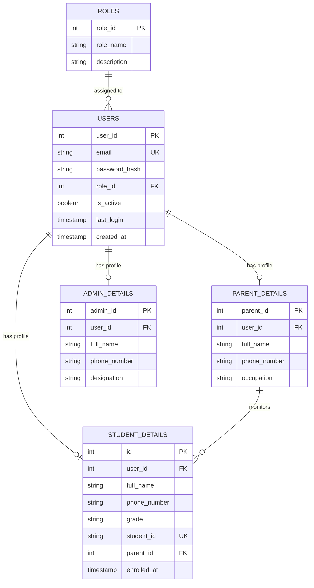
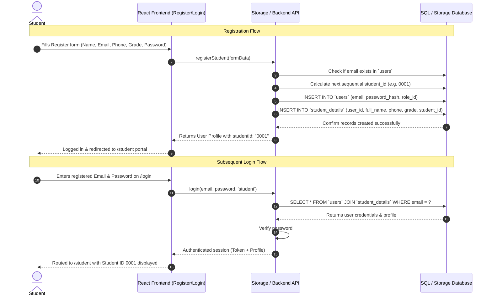

# PLMS SQL Database Architecture & Auth Mapping

This documentation explains the SQL relational database structure for **PLMS (Private Learning Management System)**, specifically mapping how **Registration** stores data and how **Login** retrieves and verifies it.

---

## 1. Architecture Overview: Clean Separation of Concerns

To follow standard industry and academic best practices (3rd Normal Form - 3NF):
1. **Authentication Data (`users` table)**: Stores only what is needed for logging in (email, hashed password, role, account status).
2. **Registration / Profile Data (`student_details`, `parent_details`, `admin_details`)**: Stores personal and academic details separately, linked to `users` via `user_id` Foreign Key.
3. **No Sample Users**: All dummy sample student and parent accounts (`Kasun Perera`, `Nipuni Silva`, `Sunil Perera`, etc.) have been completely removed. Accounts are created dynamically through the registration portal.
4. **Sequential Student ID (0001 to Higher Order)**: Student IDs are strictly assigned in sequential order starting from `0001` (`0001`, `0002`, `0003`, ..., `9999`, `10000+`), essential for tuition cards, attendance, fee tracking, and future examination indexing.

---

## 2. Entity Relationship (ER) Diagram



---

## 3. Frontend Form to SQL Table Field Mapping

### A. Register Form (`Register.jsx`)

| Frontend Form Field (`formData`) | SQL Table | Target Column | Purpose | Format / Generation |
| :--- | :--- | :--- | :--- | :--- |
| `formData.email` | `users` | `email` | Unique login identifier | Valid email address |
| `formData.password` | `users` | `password_hash` | Hashed credential | Stored as bcrypt hash |
| Role ('student') | `users` | `role_id` | Role foreign key | `1` (= Student) |
| `formData.name` | `student_details` | `full_name` | Student's display name | Full student name |
| `formData.phone` | `student_details` | `phone_number` | WhatsApp / Contact | e.g. `+94 77 123 4567` |
| `formData.grade` | `student_details` | `grade` | Enrolled grade | e.g. `Grade 11 (O/L Mathematics)` |
| *(Auto-generated)* | `student_details` | `student_id` | Unique sequential Student ID | **`0001` to Higher Order** (`0001`, `0002`, `0003`...) |

---

### B. Login Form (`Login.jsx`)

| Role | Frontend Field | SQL Verification Step | Target Table & Column |
| :--- | :--- | :--- | :--- |
| **Student** | **`studentId` (e.g., `0001`)** | Look up student record by Student ID | `student_details.student_id` |
| **Admin** | `email` (`admin@plms.com`) | Look up administrator account | `users.email` |
| **All** | `password` | Compare hash (bcrypt) | `users.password_hash` |
| **All** | `selectedRole` | Verify role match | `roles.role_name` |

---

## 4. Sequential Student ID Rule (`0001` to Higher Order)

Student IDs are strictly formatted as a 4-digit zero-padded number (or higher order for 5+ digits):
- 1st Enrolled Student: `0001`
- 2nd Enrolled Student: `0002`
- 3rd Enrolled Student: `0003`
- ...
- 9999th Enrolled Student: `9999`
- 10000th Enrolled Student: `10000`

In SQL, this is computed dynamically during registration:
```sql
SELECT LPAD(COALESCE(MAX(CAST(student_id AS UNSIGNED)), 0) + 1, 4, '0') AS next_student_id
FROM student_details;
```

---

## 5. End-to-End Workflow: Register to Login



---

## 6. SQL Verification Queries

To check that registered students are properly saved in your SQL database:

```sql
-- 1. View all registered students and their sequential IDs:
SELECT 
    sd.student_id,
    sd.full_name,
    u.email,
    sd.phone_number,
    sd.grade,
    sd.enrolled_at
FROM student_details sd
JOIN users u ON sd.user_id = u.user_id
ORDER BY CAST(sd.student_id AS UNSIGNED) ASC;

-- 2. Verify next student ID to be assigned:
SELECT LPAD(COALESCE(MAX(CAST(student_id AS UNSIGNED)), 0) + 1, 4, '0') AS next_id_to_assign
FROM student_details;
```

---

## 7. SQL Files Included

1. [01_schema.sql](file:///c:/Users/Sakvithi/Documents/OPEN%20UNIVERSITY/PLMS/PLMS.web/database/01_schema.sql) - Table creation with foreign keys, constraints, and index optimizations.
2. [02_seed_data.sql](file:///c:/Users/Sakvithi/Documents/OPEN%20UNIVERSITY/PLMS/PLMS.web/database/02_seed_data.sql) - Core roles and Head Educator / Admin account (`admin@plms.com` / `password123`). Sample students removed.
3. [03_auth_queries.sql](file:///c:/Users/Sakvithi/Documents/OPEN%20UNIVERSITY/PLMS/PLMS.web/database/03_auth_queries.sql) - Transactional registration with automatic sequential `0001` calculation and login authentication queries.
