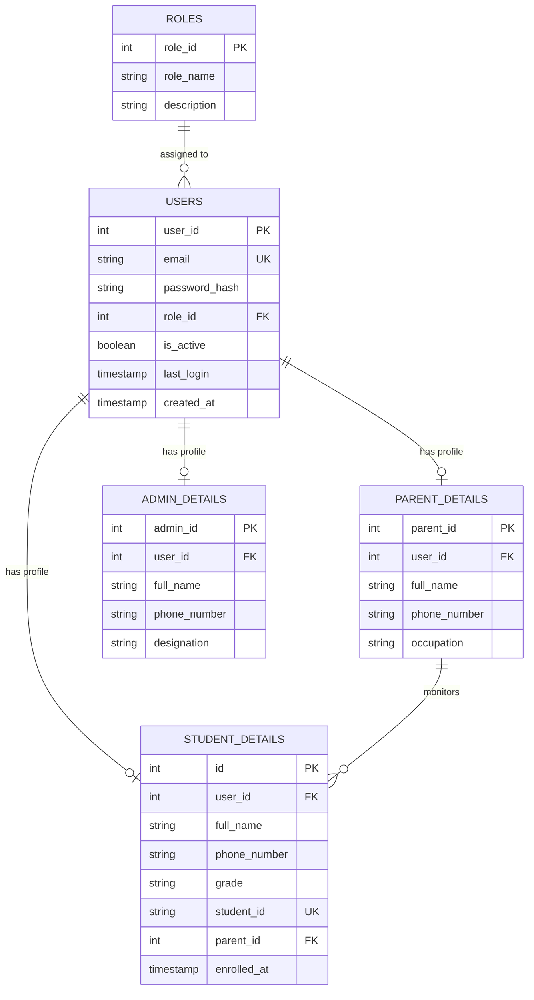
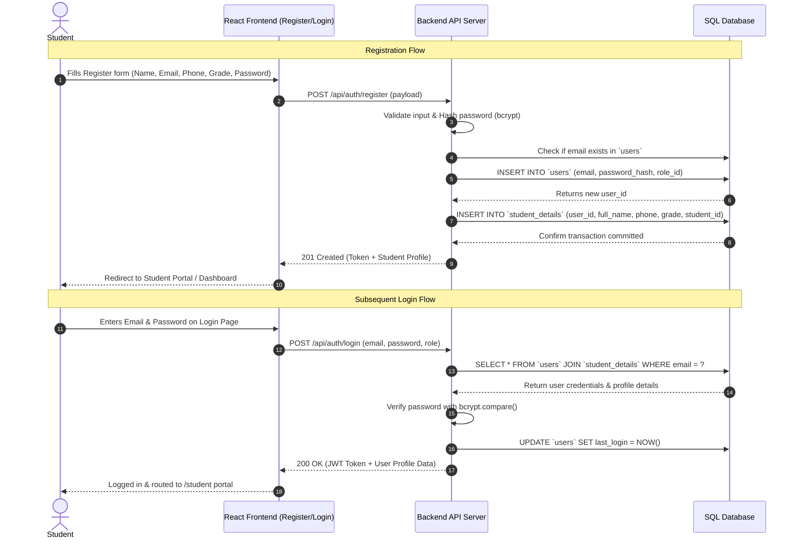

# PLMS SQL Database Architecture & Auth Mapping

This documentation explains the SQL relational database structure for **PLMS (Private Learning Management System)**, specifically mapping how **Registration** stores data and how **Login** retrieves and verifies it.

---

## 1. Architecture Overview: Clean Separation of Concerns

To follow standard industry and academic best practices (3rd Normal Form - 3NF):
1. **Authentication Data (`users` table)**: Stores only what is needed for logging in (email, hashed password, role, account status).
2. **Registration / Profile Data (`student_details`, `parent_details`, `admin_details`)**: Stores personal and academic details separately, linked to `users` via `user_id` Foreign Key.

---

## 2. Entity Relationship (ER) Diagram

---

## 3. Frontend Form to SQL Table Field Mapping

### A. Register Form (`Register.jsx`)

| Frontend Form Field (`formData`) | SQL Table | Target Column | Purpose |
| :--- | :--- | :--- | :--- |
| `formData.email` | `users` | `email` | Unique login identifier |
| `formData.password` | `users` | `password_hash` | Stored as bcrypt hash |
| Role ('student') | `users` | `role_id` | Role foreign key (1 = Student) |
| `formData.name` | `student_details` | `full_name` | Student's display name |
| `formData.phone` | `student_details` | `phone_number` | WhatsApp / Contact number |
| `formData.grade` | `student_details` | `grade` | Enrolled grade |
| *(Auto-generated)* | `student_details` | `student_id` | Unique student ID (e.g., `STU-2026-889`) |

---

### B. Login Form (`Login.jsx`)

| Frontend Field | SQL Verification Step | Target Table & Column |
| :--- | :--- | :--- |
| `email` | Look up account | `users.email` |
| `password` | Compare hash | `users.password_hash` |
| `selectedRole` | Verify role match | `roles.role_name` |

---

## 4. End-to-End Workflow: Register to Login

---

## 5. SQL Files Included

1. [01_schema.sql](file:///c:/Users/Sakvithi/Documents/OPEN%20UNIVERSITY/PLMS/PLMS.web/database/01_schema.sql) - Table creation with foreign keys, uniqueness constraints, and performance indexes.
2. [02_seed_data.sql](file:///c:/Users/Sakvithi/Documents/OPEN%20UNIVERSITY/PLMS/PLMS.web/database/02_seed_data.sql) - Initial roles and default accounts (`student@plms.com`, `admin@plms.com`, `parent@plms.com`).
3. [03_auth_queries.sql](file:///c:/Users/Sakvithi/Documents/OPEN%20UNIVERSITY/PLMS/PLMS.web/database/03_auth_queries.sql) - Transactional registration query and login authentication queries.
